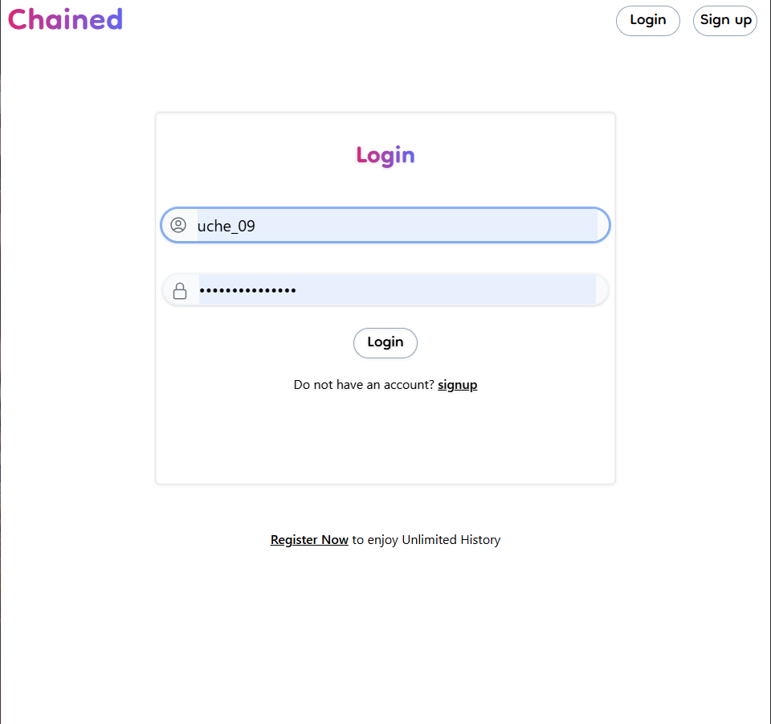

# Chained

## Description
Chained is a URL shortening web application service that helps streamline you and your customers/users online experience, by providing short, descriptive and concise URL for your platforms, services and any online presence.


## Demo
The link below is a short demonstration video of how it works.

https://youtu.be/iZaVcIFGB3k


## Features
The following are expected features of the service indicating which has been completed and which has not:
- [x] User Registration and Authentication
- [x] Anonymous usage (usage without registration).
- [x] URL shortening
- [x] Custom short URL creation.
- [] URL Analytics (TODO)
  - URL Performance
  - URL Tracking

## Tech Stack
**Client:** HTML, Tailwindcss

**Server:** Flask

**Database:** SQLite

## Structure


This project was built with maintainability and scalability in mind. 
- **config.py:** Has all flask configuration for the app.
- **manage.py:** This is the file that creates the flask app. This is the file starts the server.
- **models.py:** The database model.
- **utility.py:** Contains helper functions.
- **app/routes/:** Is a package containing all the routes as individual file, ie each route can be maintained individually without affecting the entire app.
- **app/static/:** Contains all static files such as images, js and css files.
- **app/templates/:** Contains all application web pages as .html file dynamically rendered with jinja2 template in flask.
- **instance/:** This folder is generated by flask-migrate the database migration program which holds the sqlite db file.
- **migrations/:** This folder is also generated by flask-migrate, a version control program for database.

## Environment Variables
To run this project, you will need to add the following environment variables to your .env file

`FLASK_ENV`(development or production)
`SECRET_KEY`
`DATABASE_URI` (if using a hosted database)

## Run Locally
First, you have python3 installed on your system.

Go to the project directory

```bash
  cd <parent-folder>/chained
```

Install dependencies

```bash
  pip install -r requirements.txt
```

Apply Migration to create database schema on the database in use.

```bash
  flask db upgrade
```


Start the server

```bash
  flask run
```


## Screenshots





